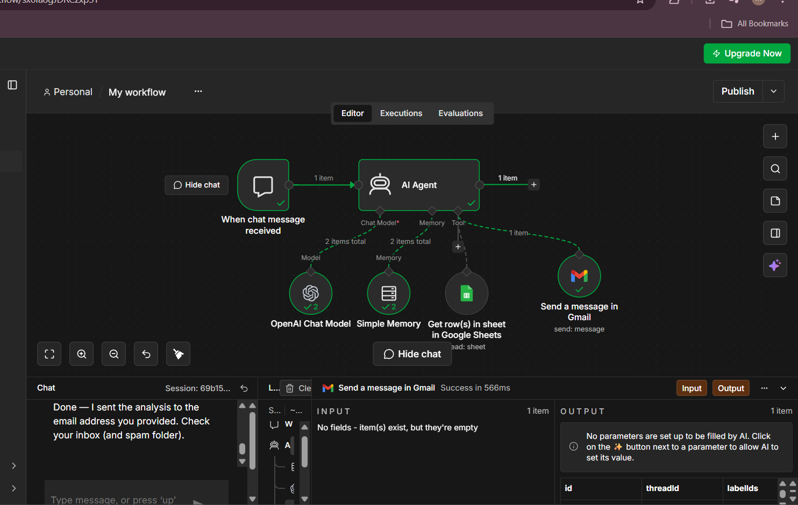

# 📊 Data Analytics AI Agent (n8n)

An n8n-powered conversational AI agent that reads data from Google Sheets, analyzes it on request, and can email professional HTML reports via Gmail — all through a simple chat interface.



## ✨ Features

- 💬 **Chat-based interface** — ask questions in plain language via the n8n chat trigger
- 📥 **Google Sheets integration** — fetches live spreadsheet data on demand
- 🧠 **Conversational memory** — retains the last 10 messages of context (buffer window memory)
- 🤖 **LLM-powered analysis** — uses an OpenAI chat model (GPT-5 mini) to interpret and analyze data
- 📧 **Automated email reports** — sends nicely formatted HTML summaries via Gmail on request

## 🧩 Workflow Architecture

```
Chat Trigger → AI Agent ──┬── OpenAI Chat Model (LLM)
                           ├── Simple Memory (buffer window, 10 messages)
                           ├── Get row(s) in sheet (Google Sheets tool)
                           └── Send a message in Gmail (email tool)
```

**Nodes:**
| Node | Type | Purpose |
|---|---|---|
| When chat message received | Chat Trigger | Entry point for user messages |
| AI Agent | LangChain Agent | Orchestrates reasoning and tool calls |
| OpenAI Chat Model | LM Chat (OpenAI) | Powers the agent's reasoning (gpt-5-mini) |
| Simple Memory | Buffer Window Memory | Keeps last 10 messages of conversation |
| Get row(s) in sheet in Google Sheets | Google Sheets Tool | Reads data from a connected spreadsheet |
| Send a message in Gmail | Gmail Tool | Sends HTML-formatted email reports |

## 🚀 Setup

1. Import [`workflow/data-analysis-ai-agent-n8n.json`](./workflow/data-analysis-ai-agent-n8n.json) into your n8n instance (**Workflows → Import from File**).
2. Configure credentials:
   - **OpenAI API** — for the chat model
   - **Google Sheets OAuth2** — for reading spreadsheet data
   - **Gmail OAuth2** — for sending email reports
3. Open the **Get row(s) in sheet** node and set your target `documentId` and `sheetName`.
4. Open the **Send a message in Gmail** node and configure the recipient/subject as needed.
5. Activate the workflow and open the chat panel to start interacting with the agent.

## 💬 Example Usage

```
User: Load the sales data from my sheet
Agent: [fetches rows via Google Sheets tool, summarizes the data]

User: Email me a summary of this analysis
Agent: [formats an HTML report and sends it via Gmail]
```

## 🛠️ Tech Stack

- [n8n](https://n8n.io/) — workflow automation platform
- [LangChain n8n nodes](https://docs.n8n.io/integrations/builtin/cluster-nodes/) — AI agent orchestration
- OpenAI GPT-5 mini — language model
- Google Sheets API
- Gmail API

## 📁 Repository Structure

```
data-analytics-ai-agent/
├── README.md
├── LICENSE
├── .gitignore
├── workflow/
│   └── data-analysis-ai-agent-n8n.json
├── screenshots/
│   └── workflow-overview.png
└── docs/
```

## 📄 License

This project is licensed under the MIT License — see [LICENSE](./LICENSE) for details.

## ⚠️ Note

The exported workflow JSON does **not** contain any credentials (API keys, OAuth tokens). You must connect your own OpenAI, Google Sheets, and Gmail credentials after importing.
